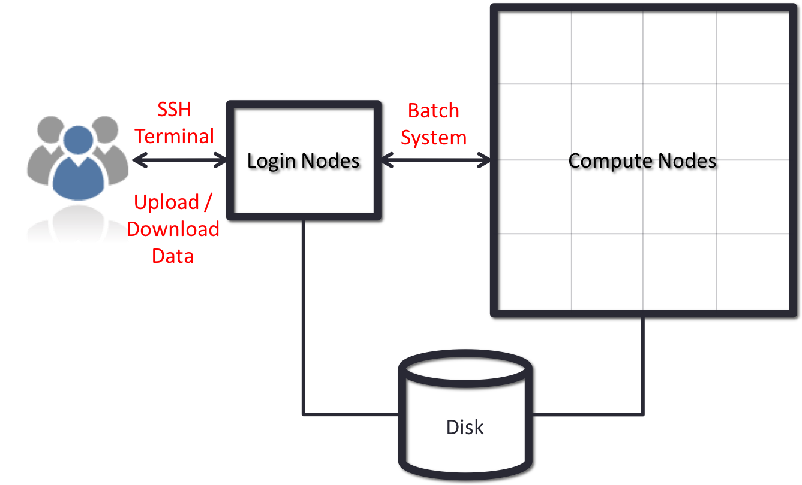

<!-- Still need to add exercises to this episode -->

# What is a High-Performance Computer?

A high-performance computer (HPC system) is a tool used by computational scientists and engineers to tackle problems that require more computing resources or time than they can obtain on the personal computers available to them. HPC systems range in size from the equivalent of just a few personal computers to tens, or even hundreds of thousands of them.  They tend to be expensive to buy and operate, so they are often shared at the departmental or institutional level.  There are also many regional and national HPC centers.  Because of this, most HPC systems are accessed remotely, over the network.

HPC systems are generally constructed from many individual computers, similar in capability to many personal computers, connected together by some type of network (often referred to as the *interconnect*).  Each of these individual computers is often referred to as a *node*. HPC systems often include several different types of nodes, which are specialized for different purposes.  *Head* (or *front-end* or *login*) nodes are where you login to interact with the HPC system.  *Compute* nodes are where the real computing is done. You generally do not have access to the compute nodes
directly - access to these resources is controlled by a *scheduler* or *batch system* (more on this later!).

Depending on the HPC system, the compute nodes, even individually, might be much more powerful than a typical personal computer.  They often have multiple processors (each with many cores), and may have accelerators (such as *Graphics Processing Units (GPUs)*) and other capabilities less common on personal computers.

> ## HPC systems are made up of many computers linked together
> Each individual "computer" component of an HPC system is known as a *node*. Different types of node exist for different tasks. The nodes are connected together by a network usually known as the *interconnect*.
{: .callout}

## The Scheduler

In order to share these large systems among many users, it is common to allocate subsets of the compute nodes to tasks (or *jobs*), based on requests from users.  These jobs may take a long time to complete, so they come and go in time. To manage the sharing of the compute nodes among all of the jobs, HPC systems use a *batch system* or *scheduler*.  The batch system usually has commands for submitting jobs, inquiring about their status, and modifying them.  The HPC center defines the priorities of different jobs for execution on the compute nodes, while ensuring that the compute nodes are not overloaded.

For example, a typical HPC workflow could look something like this:

1. Transfer input datasets to the HPC system (via the login nodes)
2. Create a job submission script to perform your computation (on the login nodes)
3. Submit your job submission script to the scheduler (on the login nodes)
4. Scheduler runs your computation (on the compute nodes)
5. Analyse results from your computation (on the login or compute nodes, or transfer data for analysis elsewhere)

We will discuss the scheduler more later.

## Storage and *File Systems*

The kind of computing that people do on HPC systems often involves very large files, and/or many of them.  Further, the files have to be accessible from all of the front-end and compute nodes on the system.  So most HPC systems have specialized file systems that are designed to meet these needs. Frequently, these specialized file systems are intended to be used only for short- or medium-term storage, not permanent storage.  As a consequence of this, most HPC systems often have several different file systems available -- for example *home*, and *scratch* file systems.  It can be very important to select the right file system to get the results you want (performance or permanence are the typical trade-offs).

Your instructor will provide details of the file systems that are available on the HPC system you are using for this lesson.

## Accessing Software on HPC Systems

Because HPC systems serve many users with different software needs, HPC systems often have multiple versions of commonly used software packages installed.  Since you cannot easily install and use different versions of a package at the same time without causing potential issues, HPC systems often use *environment modules* (often shortened to *modules*) that allow you to configure your software environment with the particular versions of software that you need. We will learn more about modules and how they work later in this lesson.

Many HPC systems also have a custom environment that means that binary software packages (for example, those you may download from websites) will not simply work "out-of-the-box". They may need differnt options or settings in your job script to make them work or, at worst, may need to be recompiled from source code to work on the HPC system.

# What does all this mean for me?

A few properties of HPC systems mean that you often need to modify your computational workflow from your local system:

* **HPC systems are a shared resource** 
  - You cannot get administrator access to the system to install software
  - A scheduler is used to control access to compute resources meaning that your work may not run instantaneously
  - Environment modules are used to control your software environment
* **HPC systems are accessed remotely**
  - You will often need to transfer data to/from the HPC system
  - Access is generally via a command line interface rather than a graphical interface
* **HPC systems often have more than one file system**
  - These file systems differ in purpose and properties
  - You often need to be aware of which file system you are using and why
* **HPC systems are parallel resources**
  - You usually need to be able to use resources in parallel to benefit from HPC
  - This parallelism can be achieved in a number of ways: from many independent tasks (HTC) to a single large parallel computation

Understanding more about how HPC systems work and achieve high performance will allow you to appreciate better the opportunities and challenges for using HPC for your research.

Now lets get going and actually connect to an HPC system!

