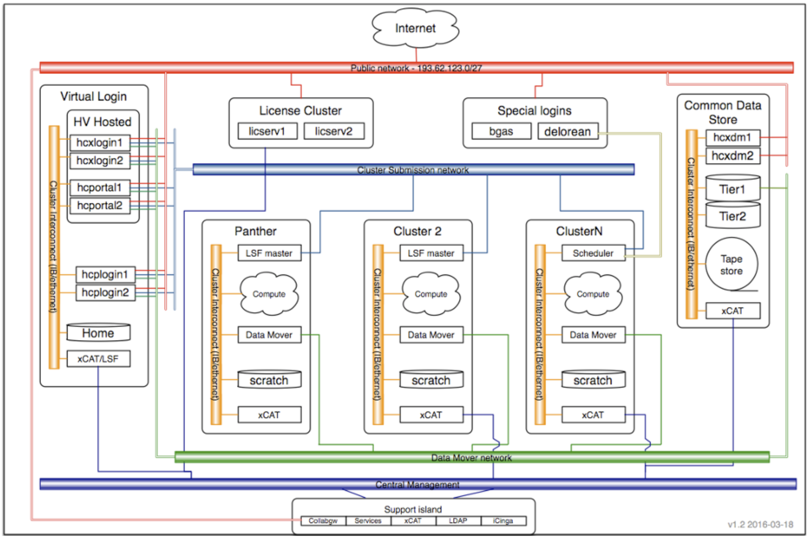

An HPC system is a SHARED resource it might have thousands of nodes but it could also have thousands of users.
How do we decide who gets what and when?
How do we ensure that a task is run with the resources it needs?
This job is handled by a special piece of software called the scheduler.
On an HPC system, the scheduler manages which jobs run where and when.


The scheduler used in this lesson is LSF.
Although LSF is not used everywhere, 
running jobs is quite similar regardless of what software is being used.
The exact syntax might change, but the concepts remain the same.

## Running a batch job

The most basic use of the scheduler is to run a command non-interactively. Any command (or series of commands) that you want to run on the cluster is 
called a *job*, and the process of using a scheduler to run the job is called *batch job submission*.  

In this case, the job we want to run is just a shell script. Let's create a demo shell script to run as a test.

> ## Creating our test job
> 
> Using your favorite text editor, create the following script and run it.
> Does it run on the compute nodes or the login node?
>
>```
>#!/bin/bash
>
> echo 'This script is running on:'
> hostname
> sleep 120
>```
{: .challenge}

If you completed the previous challenge successfully, 
you probably realize that there is a distinction between 
running the job through the scheduler and just "running it".
To submit this job to the scheduler, we use the ``bsub`` command
(assuming our script is called *example-job.sh*):

``` 
[remote]$ bsub -q panther -n 1 -W 00:02 ./example-job.sh
```
{: .bash}
```
Job <123456789> is submitted to queue <panther>.
```
{: .output}


And that's all we need to do to submit a job.  Our work is done -- now the 
scheduler takes over and tries to run the job for us.  While the job is waiting 
to run, it goes into a list of jobs called the *queue*.

To check on our job's status, we check the queue using the command ``bjobs``.

```
[remote]$ bjobs
```
{: .bash}
```
rrb67-mxf04:hcplogin4 >bjobs
JOBID   USER    STAT  QUEUE      FROM_HOST   EXEC_HOST   JOB_NAME   SUBMIT_TIME
1422    rrb67-m RUN   paragon    hcplogin4   tpge110.clu *0.cluster Jun  5 18:37

```
{: .output}

We can see all the details of our job, most importantly that it is in the "RUN" (Running) status.
Sometimes our jobs might need to wait in a queue, "PEND" (Queued or PENDING) state or have an error.
The best way to check our job's status is with ``qstat``.
Of course, running ``bjobs`` repeatedly to check on things can be a little tiresome.
To see a real-time view of our jobs, we can use the ``watch`` command.
``watch`` reruns a given command at 2-second intervals. 
Let's try using it to monitor another job.

```
rrb67-pxs01:hcplogin2 > bsub -q panther -n 1 -W 00:03 example-job.sh
rrb67-pxs01:hcplogin2 > watch bjobs
```
{: .bash}

You should see an auto-updating display of your job's status.
When it finishes, it will disappear from the queue.
Press ``Ctrl-C`` when you want to stop the ``watch`` command.

## Output from a job

You may be wondering where the output from your job goes. When you type the `hostname` command
at the terminal the output comes straight back to you, but a job cannot do this as you may not 
even be logged in when the job runs.

By default, each LSF job should create two files based on the job script name; one with `.o` and the
job ID appended and one with `.e` and the job ID appended. For the job we submitted above, with
the script called `example-job.sh` and the job ID `319011`. 

- example-job.sh.o319011
- example-job.sh.e319011

But as you have just discovered you don't get any output! This is because LSF is not configured
here at the Hartree Centre to create both the ``default`` standard output or standard error files:

So the is why you get no output from the job you just tried to run!
You have to use this instead.

```
rrb67-pxs01:hcplogin2 > bsub -q panther -n 1 -W 00:03 -o test%J.o -e example-job.sh.e%J example-job.sh
rrb67-pxs01:hcplogin2 > watch bjobs
```
{: .bash}

These files contain the output that would have been printed to the terminal if you used the commands
in the job script interactively rather than in a batch job. The `.o` file contains output
to  *standard out (or stdout)*; this output is usually the output you expect when the command 
ran as expected (e.g. the name of the host from `hostname`). The `.e` file contains output to
*standard error (or stderr)*; this includes any error messages that would have been printed (e.g.
if the `hostname` command could not be found, this error would be in this file).

It is usually a good idea to check the contents of the `.e` file to see if anything went wrong with
your job (although, more often, people actually check the expected output and then only go and 
check for errors if something looks odd!).

## What just happened!!!  DUDE WHERE ARE MY FILES???

Here is image of the files system here at the Hartree, does that help???



Hmmmm thought not, what happened is that this file/network system is really awkward.
You actually have hidden home directories. So each compute cluster has it's own home directory.

So you probably just want to me to tell you where your files are by now.  Okay but careful what you wish for!!!

cd /gpfs/panther/local/.....<your project id>/userid/....

echo $HOME
and just change fairthorpe to panther
that is your home directory on panther you should find 

- test#####.o 
- example-job.sh.e#####

so you should cat the test#####.o and see the output of you job so we can move on...getting behind schedule.

## What do you mean it could not find the example-job.sh????

That is correct because your script is in your ``HOME`` directory on the login nodes and not in the ``HOME`` directory on Panther's SCRATCH filesystem.  

Okay so all we have to do is move the example-job.sh to the ``HOME`` directory on Panther's SCRATCH filesystem.


So to run a script like this we have to do everything from the ``HOME`` directory on Panther's SCRATCH filesystem.
You have to manually stage the data and executable(s) to the SCRATCH filesystem and submit the job from there!
So is there a better way? YES. But copy the example.sh script to Panther SCRATCH then cd to that folder.
Submit the same command and this time you should get the test####.o and test####.e  files.  In HPC this is commonly referred to your ``dot O`` and ``dot E`` files.

```
rrb67-mxf04:hcplogin4 >more test1436.o 
Sender: LSF System <lsfadmin@tpge112.cluster>
Subject: Job 1436: <./example-job.sh> in cluster <pted> Done

Job <./example-job.sh> was submitted from host <hcplogin4> by user <rrb67-mxf04> in cluster <fairted> at Wed Jun  5 20:27:40 2019.
Job was executed on host(s) <tpge112.cluster>, in queue <fairted>, as user <rrb67-mxf04> in cluster <pted> at Wed Jun  5 20:27:40 2019.
</gpfs/paragon/local/HCI009/mxf04/rrb67-mxf04> was used as the home directory.
</gpfs/paragon/local/HCI009/mxf04/rrb67-mxf04> was used as the working directory.
Started at Wed Jun  5 20:27:40 2019.
Terminated at Wed Jun  5 20:28:12 2019.
Results reported at Wed Jun  5 20:28:12 2019.

Your job looked like:

------------------------------------------------------------
# LSBATCH: User input
./example-job.sh
------------------------------------------------------------

Successfully completed.

Resource usage summary:

    CPU time :                                   0.04 sec.
    Max Memory :                                 5 MB
    Average Memory :                             1.00 MB
    Total Requested Memory :                     -
    Delta Memory :                               -
    Max Swap :                                   -
    Max Processes :                              4
    Max Threads :                                5
    Run time :                                   42 sec.
    Turnaround time :                            32 sec.

The output (if any) follows:

This script is running on:
tpge112


PS:

Read file <test1436.e> for stderr output of this job.

```
{: .output}

The test####.file should be empty!!

## Customizing a job

The job we just ran used all of the scheduler's default options.
In a real-world scenario, that's probably not what we want.
The default options should represent a reasonable default.
Chances are, we will need more cores, more memory, more time, 
among other special considerations.
To get access to these resources we must customize our job script.

Comments in Unix (denoted by `#`) are typically ignored.
But there are exceptions.
For instance the special `#!` comment at the beginning of scripts
specifies what program should be used to run it (typically `/bin/bash`).
Schedulers like LSF also have a special comment used to denote special 
scheduler-specific options or `Directives`
though these comments differ from scheduler to scheduler.
LSF's special comment is `#BSUB`.
Anything following the `#BSUB` comment is interpreted as an instruction to the scheduler.


### Resource requests

But what about more important changes, such as the number of cores and runtime for our jobs?
One thing that is absolutely critical when working on an HPC system is specifying the 
resources required to run a job.
This allows the scheduler to find the right time and place to schedule our job.
If you do not specify requirements (such as the amount of time you need), 
you will likely be stuck with your site's default resources,
which is probably not what we want.

The following LSF options show how to control resource requests:

- `-n <total number of physical cores>` - how many nodes and cores per node does your job need? 
- `-W walltime=<hours:minutes>` - How much real-world time (walltime) will your job take to run?
- `-R "span[ptile=<number of MPI tasks per node>]" - The max is 16!

Note that just *requesting* these resources does not make your job run faster!  We'll 
talk more about how to make sure that you're using resources effectively in a later 
episode of this lesson.  

> ## Submitting resource requests
>
> Submit a job that will use 2 nodes, 16 cores per node, and 5 minutes of walltime.
{: .challenge}


Resource requests are typically binding. If you exceed them, your job will be killed.
Let's use walltime as an example.  We will request 30 seconds of walltime, 
and attempt to run a job for two minutes.

## Cancelling/deleting a job

Sometimes we'll make a mistake and need to cancel/delete a job.
This can be done with the `bkill` command.
Let's submit a job and then cancel it using its job number.
```
rrb67-pxs01:hcplogin2 > bsub -q panther -n 1 -W 00:03 -o test%J.o -e example-job.sh.e%J example-job.sh
rrb67-pxs01:hcplogin2 > watch bjobs
```
{: .bash}

```
JOBID   USER    STAT  QUEUE      FROM_HOST   EXEC_HOST   JOB_NAME   SUBMIT_TIME   FINISH_TIME
1436    rrb67-m RUN   paragon    hcplogin4   tpge112.clu *le-job.sh Jun  5 20:27  Jun  5 20:37 L

```
{: .output}

Now cancel the job with it's job number. 
Absence of any job info indicates that the job has been successfully canceled.

```
[remote]$ bkill 1436
[remote]$ bjobs
```
{: .bash}
```
[No output as there are no jobs]
```
{: .output}

## Other types of jobs

Up to this point, we've focused on running jobs in batch mode.
LSF also provides the ability to run tasks as a one-off or start an interactive session.

### Interactive jobs

Sometimes, you will need a lot of resource for interactive use.
Perhaps it's our first time running an analysis 
or we are attempting to debug something that went wrong with a previous job.
Fortunately, we can start an interactive job with `bsub`:

```
[remote]$ bsub -Is -q pantherI /bin/bash
{: .bash}
```
rrb67-mxf04:hcplogin4 > bsub -Is -q paragonI -W 00:10   /bin/bash
Job <1438> is submitted to queue <paragonI>.
<<Waiting for dispatch ...>>


[compute]$ 
```
{: .output}

You should be presented with a bash prompt.
Note that the prompt will likely change to reflect your new location, 
in this case the compute node we are logged onto.
You can also verify this with `hostname` and/or `pwd`

When you are done with the interactive job, type `exit` to quit your session.

